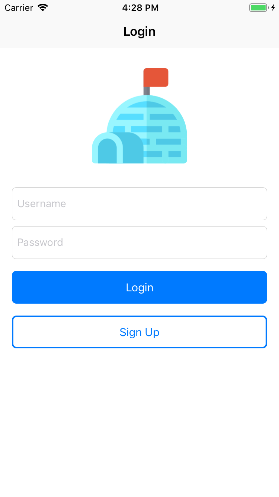
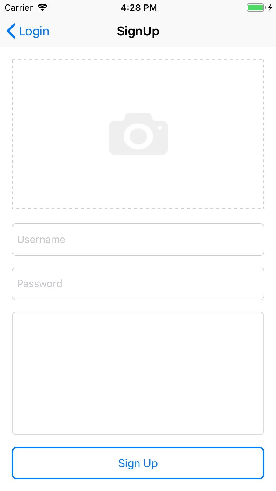
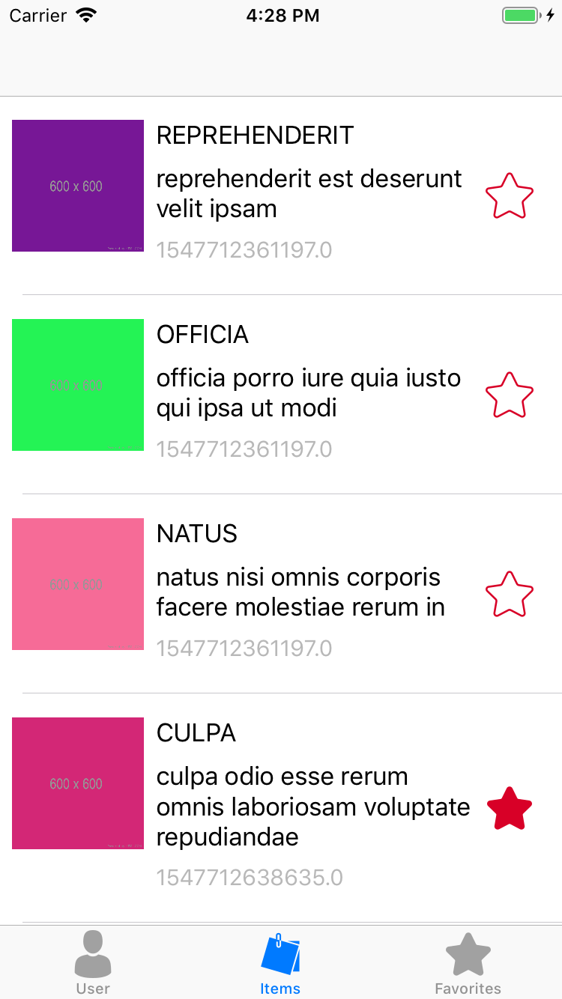
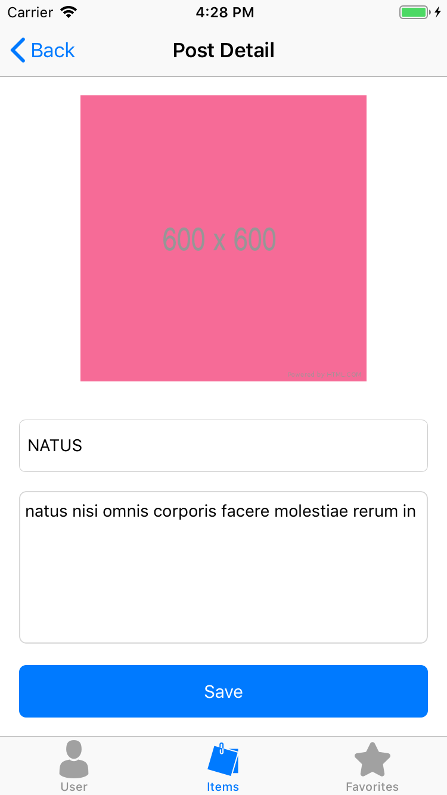
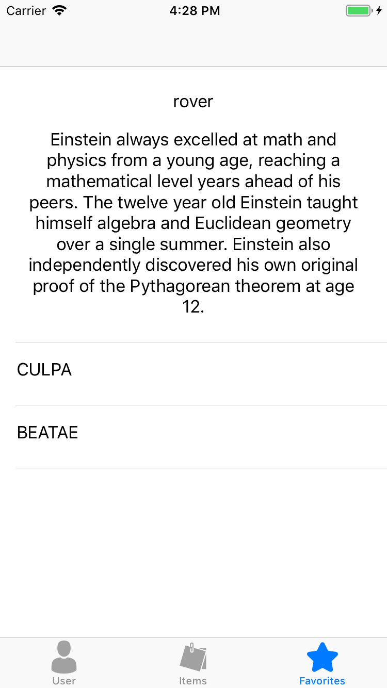
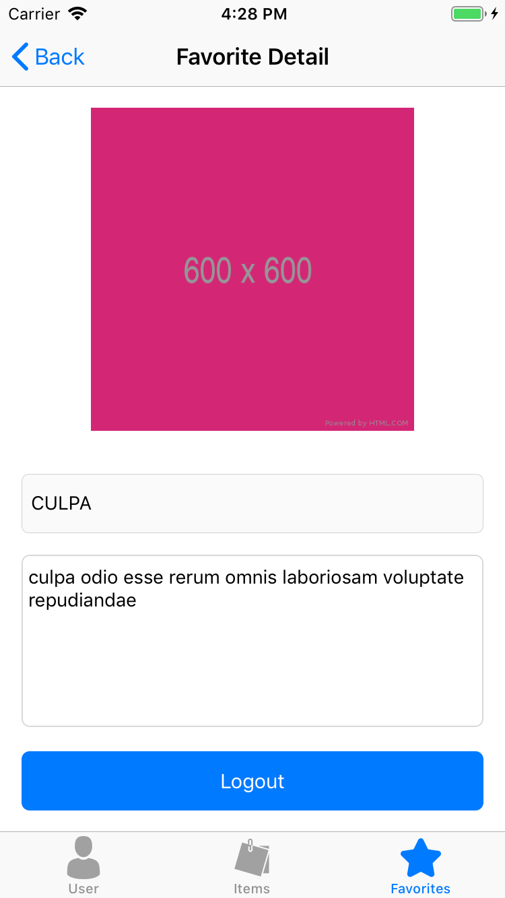
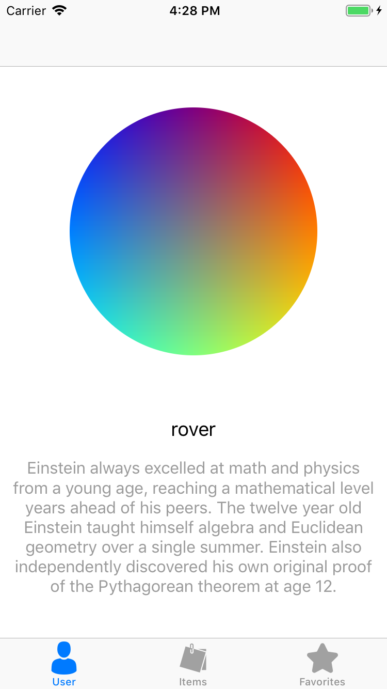

# Deskemo
A sample iOS application for Deskera. 

Time spent: **12** hours spent in total

## User Stories

The following **required** functionality is completed:

### Screen 1: Login screen
- [x] Simple Login Screen with Logo ( any Image) and Username/Password Fields.
- [x] onClick() of LoginBtn, navigate to Screen 3.
- [x] onClick() of Sign Up, navigate to Screen 2.
- [x] Does not need to implement authentication.

### Screen 2: Sign up screen
- [ ] Should be able to add picture from
Gallery/Photos.
- [x] Input fields for user to enter details.
- [ ] Save data locally (to be reflected in screen 5)
- [x] onClick() of Sign Up button, navigate to
Screen 3.

### Screen 3 - Item screen
- [x] Fetch the sample data (JSON, or temp, or even hardcoded)
- [x] Boxes should have image displayed.
- [x] Should be able to mark item as a favorite.
- [x] onClick() of item, navigate to Screen 4.

### Screen 4 - Item detail screen
- [x] Show details of selected item.
- [x] Should be editable.
- [x] Should include “Date” control.
- [x] Edited information should reflect in Screen 3.

### Screen 5 - User screen
- [x] Show information of logged in user. (with dummy data).
- [ ] If user go through screen 2, show information
entered from there.

### Screen 6 - Favorite screen
- [x] Only items that were marked as favorite in Screen 3 should show up in this screen.

### Screen 7 - Favorite Detail screen
- [x] Show detail of selected favorite item from screen 6.
- [x] Logout functionality >> Able to logout and navigate to the first
screen.

## Technical notes

While building the app, I am using technicals below:

- [x] Clean architecture, including MVVM. Reference to [CleanArchitectureRxSwift](https://github.com/sergdort/CleanArchitectureRxSwift)
- [x] Patterns: Singleton, Navigator, Delegation, Dependency Injection, 
- [x] Reactive programming using RxSwift.
- [x] Stored locally by using Core Data.
- [x] Autolayout.
- [x] Isolate modules.
- [x] Generic protocols.
- [ ] Unit testing.

## Screenshots

Here's a walkthrough of implemented user stories:

Login                              |  Sign Up
:---------------------------------:|:-------------------------:
    |  

Items                              |  Item Detail
:---------------------------------:|:-------------------------:
    |  

Favorites                               |  Favorite Detail
:--------------------------------------:|:-------------------------:
 |  

 

## License

Copyright [2019] [Tri Ngo Minh]

Licensed under the Apache License, Version 2.0 (the "License");
you may not use this file except in compliance with the License.
You may obtain a copy of the License at

http://www.apache.org/licenses/LICENSE-2.0

Unless required by applicable law or agreed to in writing, software
distributed under the License is distributed on an "AS IS" BASIS,
WITHOUT WARRANTIES OR CONDITIONS OF ANY KIND, either express or implied.
See the License for the specific language governing permissions and
limitations under the License.